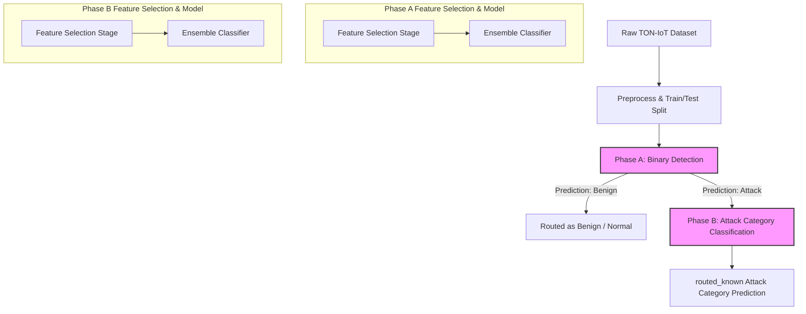
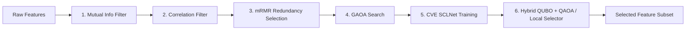

# TON-IoT Quantum Feature Selection & Classification Pipeline: Technical Documentation

This document provides a comprehensive and detailed explanation of the machine learning models, optimization algorithms, and feature selection approaches implemented in the TON-IoT Quantum Feature Selection project. It is structured to serve as an architectural and algorithmic reference for both developers and agentic AI systems.

---

## 1. Architectural Overview

The project implements a hierarchical, two-phase machine learning pipeline to detect and classify network intrusions and IoT-device cyberattacks using the TON-IoT dataset.

### The Two-Phase Pipeline
1. **Phase A — Binary Detection**: Detects whether an incoming traffic record is **Benign (0)** or an **Attack (1)**.
2. **Phase B — Attack Category Classification**: For records routed as attacks by Phase A, Phase B performs multi-class classification to identify the specific attack category (e.g., DDoS, DoS, Password, Ransomware, Scanning, Injection, backdoor, XSS, etc.).

---

## 2. Feature Selection Pipeline (6-Stage Process)

To handle high-dimensional network features efficiently, a 6-stage feature selection pipeline is executed in both Phase A and Phase B. This pipeline combines classic filter methods, genetic search, representation learning (contrastive embeddings), and quantum/classical binary optimization.

### Stage 1: Classwise Mutual Information (MI) Filtering
* **Purpose**: Perform a rapid filter of low-relevance features.
* **Mechanism**:
  Computes the class-weighted mutual information between the numeric features and the target labels. Instead of standard MI, it computes a classwise weighted average to better represent minority classes:
  
  $$\text{MI}_{\text{total}}(X_j) = \frac{\sum_{c \in C} w_c \cdot \text{MI}(X_j, y \text{ is } c)}{\sum_{c \in C} w_c}$$
  
  where $w_c = \max(10^{-6}, \text{mean}(y == c))$ represents the class prevalence.
* **Selection**: The features are ranked in descending order of $\text{MI}_{\text{total}}$, and the top-ranking subset is retained according to the `MI_KEEP_RATIO` and `MI_MAX_FEATURES` limits.

### Stage 2: Correlation-based Redundancy Filtering
* **Purpose**: Remove highly collinear features before computationally heavier selection steps.
* **Mechanism**:
  Computes the Pearson correlation matrix $R$ for the numeric features selected in Stage 1. For any pair of features $(X_i, X_j)$ where the absolute correlation coefficient $|R_{ij}| \ge \text{CORR\_THRESHOLD}$ (default: $0.90$):
  - Compare their Mutual Information scores obtained in Stage 1.
  - Retain the feature with the higher MI score and drop the other.

### Stage 3: Minimum Redundancy Maximum Relevance (mRMR) Selection
* **Purpose**: Select a subset that balances individual feature relevance with mutual feature redundancy.
* **Mechanism**:
  Iteratively constructs a feature subset $S$ from the remaining candidate set $F$. At each step, it selects the feature $X_j \in F \setminus S$ that maximizes the mRMR score:
  
  $$\text{Score}(X_j) = \text{Relevance}(X_j) - \text{Redundancy}(X_j, S)$$
  
  $$\text{Relevance}(X_j) = \text{MI}_{\text{total}}(X_j)$$
  $$\text{Redundancy}(X_j, S) = \frac{1}{|S|} \sum_{X_s \in S} \text{MI}(X_j, X_s)$$
  
  This step scales down the feature pool to a size defined by `MRMR_MAX_FEATURES`.

### Stage 4: Genetic Algorithm-like Optimization (GAOA)
* **Purpose**: Formulate feature selection as a population-based discrete optimization to find a candidate mask.
* **Mechanism**:
  Represents a feature selection configuration as a binary mask $m \in \{0, 1\}^n$, where $m_i = 1$ denotes that feature $i$ is active.
  * **Fitness Function**: Evaluates each mask $m$ using a fast Random Forest classifier trained on the training subset and validated on a validation split:
    
    $$\text{Fitness}(m) = \text{F1}(m) - \lambda \cdot \frac{\|m\|_0}{n}$$
    
    where $\text{F1}(m)$ is the macro F1-score (or binary F1-score for Phase A) on the validation set, $\|m\|_0$ is the number of active features, and $\lambda = 0.02$ (`GAOA_LAMBDA`) is the sparsity penalty.
  * **Evolutionary Operators**:
    * **Directed Drift**: Bits of individual masks are updated towards the best-performing mask in the population. If feature $i$ is active in the best mask but inactive in the current mask, it is set to active with probability $p_{\text{toward}} = 0.35$. Conversely, if it is inactive in the best mask but active in the current, it is deactivated with probability $p_{\text{away}} = 0.20$.
    * **Mutation**: Each bit is flipped with a probability $p_{\text{mutate}} = 0.05$.
    * **Constraint Projection**: If the active feature count falls outside the range $[\text{GAOA\_MIN\_FEATURES}, \text{GAOA\_MAX\_FEATURES}]$, bits are randomly toggled to restore compliance.

### Stage 5: Supervised Contrastive Embeddings (CVE) / SCLNet
* **Purpose**: Learn a low-dimensional representation space to capture multi-class geometric separability.
* **Mechanism**:
  A PyTorch deep neural network (named `SCLNet`) is trained on the feature subset identified by the GAOA stage. SCLNet projects the feature vector $x$ to a latent embedding $z \in \mathbb{R}^d$ and a projection head $p \in \mathbb{R}^d$ ($d=16$). Both vectors are $\ell_2$-normalized.
  * **Supervised Contrastive Loss (SCL)**:
    Trained using the Supervised Contrastive Loss, which forces features of the same class closer in latent space and drives features of different classes apart:
    
    $$\mathcal{L}_{\text{SCL}} = \sum_{i \in I} \frac{-1}{|P(i)|} \sum_{p \in P(i)} \log \frac{\exp(z_i \cdot z_p / \tau)}{\sum_{a \in A(i)} \exp(z_i \cdot z_a / \tau)}$$
    
    where $I$ is the batch index set, $P(i)$ is the set of indices of all samples in the batch with the same label as $i$ (excluding $i$), $A(i) = I \setminus \{i\}$, and $\tau = 0.07$ is the temperature parameter.
  * **Extracting Separability**:
    Once trained, the embeddings are used to compute:
    1. **Latent Class Centroids**: $\mu_c = \mathbb{E}[z \mid y = c]$.
    2. **Latent Scale**: The mean Euclidean distance between the class centroids:
       $$\text{latent\_scale} = \frac{2}{|C|(|C|-1)} \sum_{c_i < c_j} \|\mu_{c_i} - \mu_{c_j}\|_2$$
    3. **Feature-wise Separability**: A metric evaluating how well each raw feature's variance across class means compares to its global variance:
       $$\text{separability}_j = \frac{\text{Var}(\{\mathbb{E}[X_j \mid y = c]\}_{c \in C})}{\text{Var}(X_j) + \epsilon}$$
    4. **Contrastive Vector**: The normalized separability vector scaled by the latent class separation:
       $$\text{cont\_vec} = \text{latent\_scale} \cdot \frac{\text{separability}}{\|\text{separability}\|_2}$$

### Stage 6: Hybrid QUBO Formulation & Solver
* **Purpose**: Solve feature selection as a Quadratic Unconstrained Binary Optimization (QUBO) problem.
* **QUBO Mathematical Formulation**:
  The feature selection problem is mapped to minimizing the energy of a binary vector $x \in \{0, 1\}^n$:
  
  $$\text{Minimize } E(x) = x^T Q x = \sum_{i=1}^n Q_{ii} x_i + 2 \sum_{i < j} Q_{ij} x_i x_j$$
  
  The symmetric QUBO matrix $Q \in \mathbb{R}^{n \times n}$ is constructed as follows:
  * **Diagonal Elements ($Q_{ii}$)**: Formulate the reward for choosing feature $i$ (negative coefficient) balanced with a sparsity penalty:
    
    $$Q_{ii} = -(\alpha \cdot \text{MI\_norm}_i + \delta \cdot \text{cont\_vec\_norm}_i) + \lambda_{\text{sparsity}}$$
    
    where:
    - $\alpha = 0.50$ (Relevance weight)
    - $\delta = 0.25$ (Separability weight, derived from the contrastive SCLNet embeddings)
    - $\lambda_{\text{sparsity}} = 0.06$ (L1 sparsity cost encouraging compact subsets)
    - $\text{MI\_norm}$ and $\text{cont\_vec\_norm}$ are normalized versions of the Mutual Information and contrastive separability vectors.
  * **Off-Diagonal Elements ($Q_{ij}$)**: Penalize co-selection of redundant features:
    
    $$Q_{ij} = \beta \cdot |R_{ij}| \quad (\text{for } i \neq j)$$
    
    where:
    - $\beta = 0.25$ (Redundancy penalty weight)
    - $|R_{ij}|$ is the absolute Pearson correlation between feature $i$ and feature $j$.
* **Solving the QUBO**:
  To locate the optimal binary vector $x^*$, the pipeline utilizes one of two methods:
  1. **QAOA (Quantum Approximate Optimization Algorithm)**:
     Formulates a Hamiltonian based on the QUBO matrix and solves it via Qiskit's `MinimumEigenOptimizer` wrapped around a parameterized quantum ansatz. The parameters of the QAOA circuit are optimized classically using an optimizer like **SPSA** or **COBYLA**.
  2. **Classical Adaptive Local Search (Fallback)**:
     If Qiskit/Aer quantum simulators are unavailable, it falls back to a hill-climbing search that performs iterative bit-swaps on the active features to find the subset that minimizes the QUBO energy $x^T Q x$ within the size constraints.

---

## 3. Classification and Ensemble Modeling

Once the optimal feature subset is selected, the classification models are built.

### Ensemble Architecture
The classifier is a soft-voting ensemble comprising:
1. **XGBoost Classifier**: Gradient boosted decision trees configured with histogram-based tree building (`hist`).
2. **Random Forest Classifier**: A bagging-based forest configured with balanced bootstrap subsampling to adjust for class imbalance.
3. **LightGBM Classifier** (Optional): A light gradient boosting machine that is incorporated if the library is present in the runtime environment.

### Handling Class Imbalance
The TON-IoT dataset exhibits extreme class imbalances. The pipeline addresses this with two strategies:
1. **Effective Number of Samples Formulation**:
   Uses class-wise weights based on the effective number of samples:
   
   $$E_{n_c} = \frac{1 - \beta^{n_c}}{1 - \beta}$$
   
   $$\text{Weight}_c = \frac{1}{E_{n_c}}$$
   
   where $\beta = 0.999$ is a hyperparameter and $n_c$ is the count of samples in class $c$. The weights are normalized and clipped to the range $[0.4, 6.0]$.
2. **Scale Position Weight**:
   For binary classification (Phase A), XGBoost is supplied with `scale_pos_weight` derived as:
   
   $$\text{scale\_pos\_weight} = \frac{N_{\text{neg}} \cdot \text{Weight}_{\text{neg}}}{N_{\text{pos}} \cdot \text{Weight}_{\text{pos}}}$$
   
   which aligns pos/neg gradients according to the dynamic class weights.

### Threshold Tuning
For Phase A (binary detection), rather than using the default classification threshold of $0.5$, the pipeline tunes the threshold on a validation split. It evaluates thresholds in the range $[0.2, 0.8]$ with steps of $0.02$ and selects the threshold that maximizes the F1-score.

---

## 4. Evaluation and Explainability

### Key Metrics Tracked
* **Classification Performance**: Accuracy, Precision, Recall, F1-score (Macro and Weighted), Area Under the ROC Curve (ROC-AUC), and Precision-Recall AUC (PR-AUC).
* **Calibration and Fit Quality**:
  * **Brier Score**: Measures the mean squared difference between predicted probabilities and the actual outcomes.
  * **Kolmogorov-Smirnov (KS) Statistic**: Measures the maximum separation between the cumulative distribution functions of the positive and negative classes.
  * **False Positive Rate (FPR)**: Tracks the percentage of benign traffic incorrectly flagged as an attack.

### Model Explainability (SHAP Analysis)
To inspect feature importances, the pipeline uses SHAP (SHapley Additive exPlanations). 
* Specifically, a `TreeExplainer` is initialized on the XGBoost component of the ensemble.
* It extracts SHAP values from test set samples to compute the mean absolute SHAP value for each feature:
  
  $$I_j = \frac{1}{M} \sum_{i=1}^M |\phi_j^{(i)}|$$
  
  where $\phi_j^{(i)}$ is the SHAP value of feature $j$ for sample $i$. This represents the average impact of feature $j$ on the model output.

---

## 5. Execution Profiles and Hardware Acceleration

### Execution Profiles (`QUICK_MODE`)
The script includes a `QUICK_MODE` boolean toggle to scale dataset subsampling and model parameters for faster development and local execution:

| Parameter | Quick Mode = True | Quick Mode = False |
| :--- | :--- | :--- |
| **Phase A Sample Size** | 5,000 | 40,000 |
| **Phase B Sample Size** | 5,000 | 30,000 |
| **QAOA Repetitions** | 1 | 2 |
| **QAOA Max Iterations** | 25 | 60 |
| **GAOA Generations** | 10 | 25 |
| **Contrastive Epochs** | 6 (Phase A) / 8 (Phase B) | 10 (Phase A) / 12 (Phase B) |
| **Adaptive Feature Size Range** | 10 to 14 | 10 to 28 |

### Hardware Acceleration (GPU Usage)
* **PyTorch GPU Acceleration**: SCLNet training automatically resolves to GPU execution (`cuda`) via PyTorch if a compatible GPU and CUDA drivers are available, as specified by the system configuration rules.
* **XGBoost GPU Acceleration**: Automatically checks and configures `device='cuda'` (for XGBoost version $\ge 2.0$) or `tree_method='gpu_hist'` (for older versions) if supported by the hardware, falling back to CPU (`hist`) if not.
